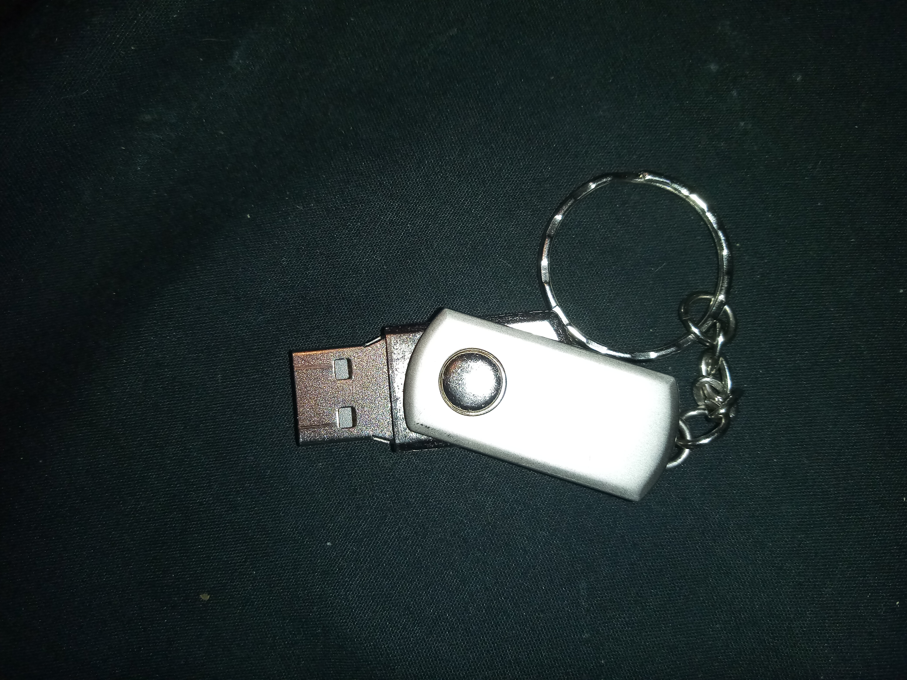
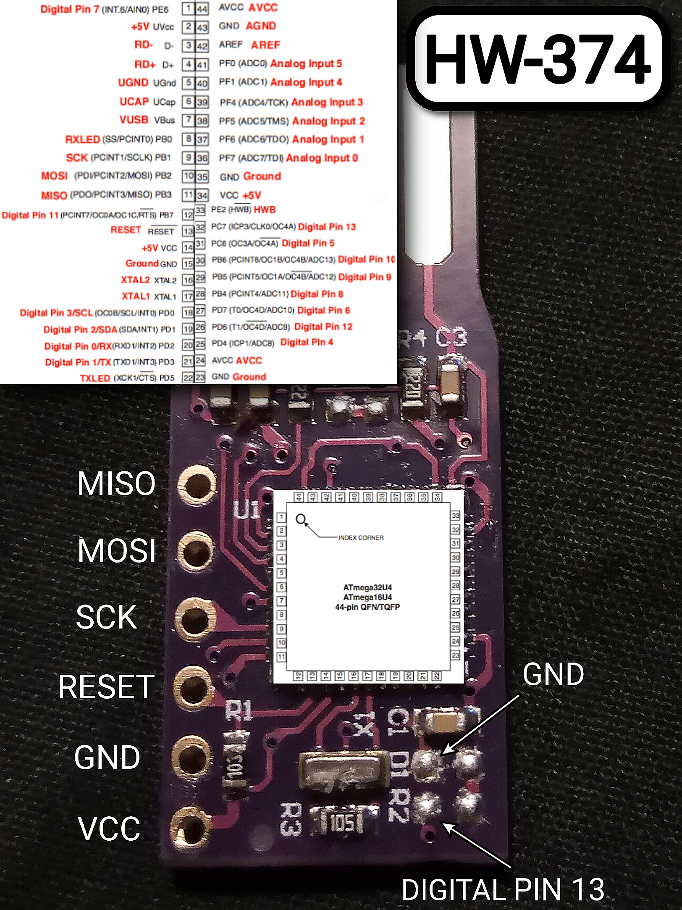

# HW-374
Arduino Clone Board A.K.A BadUSB Trace - ATmega32u4 Metal USB Device       
a.k.a BAD USB / BadUsb 

   

     
### History
These small devices are known by many sudonames on the internet, mostly surrounding the topic Arduino ATmega32u4 & Arduino Beetle Board. 
  
After opening up the device, it is not an official Arduino at all - it is a cheap Chinese clone or a SFF Small Form Factor edition of the Atmega32u4.   
 

### PROJECT
> Due to the disappointing amount of information on this board, i have decided to do my own pcb trace to the available digital pins, the aim was to find out if any usable pins are available or if this was entirely designed for HID attacks alone.
 
## Conclusion.  
### Digital PINs available are MISO, MOSI, SCK & Pin 13 ( LED )        
MISO ( Master In, Slave Out ) = Digital Pin 14     
MOSI ( Master Out, Slave In ) = Digital Pin 16    
SCK = Digital Pin 15    

An LED has not been placed in position as this would be useless with the surrounding metal encasing, this also provides me with an easy to access soldering point for the LED Pin = Digital Pin 13. 
 
So in total we have access to,       
PINS    
• 13    
• 14    
• 15    
• 16      
• VCC 5v    
• GND     
      
With 4 easily accessible digital pins, we can create some rather complex hardware controllers, the first thing in my mind is Animatronics with Servo motors.
     
         
### BOARD TRACE
DISASSEMBLY     
     

CPU PINOUT      
     

BOARD TRACE       
   

### EXAMPLE PRODUCTS
   

### SECURITY INFORMATION AND PROCEDURES      
https://www.trustwave.com/en-us/resources/blogs/spiderlabs-blog/would-you-exchange-your-security-for-a-gift-card/     
  

